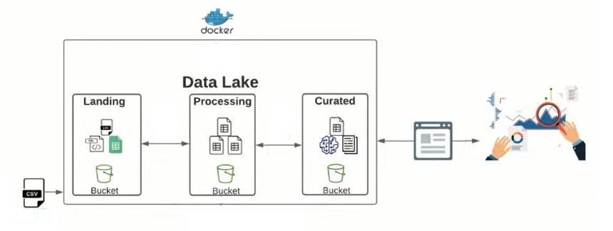

[](LICENSE.md)
[](https://github.com/ambv/black/)

# Job Salary Prediction

> The Job Salary Prediction project was developed with the aim of predicting job advertisement salaries in the United Kingdom (UK).

## Project Overview

 - [Dataset proposed (Data Understanding)](#problem-proposed)
 - [Data Lake Architecture](#architecture)
 - [Settings](#settings)

<!--- ( Dataset proposed (Data Understanding) ) --->

---

<div id="problem-proposed"></div>

## Dataset proposed (Data Understanding)

The **dataset proposed [(Job Salary Prediction)](https://www.kaggle.com/competitions/job-salary-prediction/)** consists of a large number of rows (240k+ samples) representing individual job ads.

The dataset features are:

 - **Id:**
   - A unique identifier for each job ad
 - **Title:**
   - Briefly, the **Title** is the summary of the position or function.
 - **FullDescription:**
   - The full text of the job ad as provided by the job advertiser.
   - Where you see ***s, we have stripped values from the description in order to ensure that no salary information appears within the descriptions.
   - There may be some collateral damage here where we have also removed other numerics.
 - **LocationRaw:**
   - Imagine that this column represents the job location, however, using cardinal points (West, East) and/or references.
 - **LocationNormalized:**
   - It has the same meaning as the LocationRaw column, but with less information and references.
   - That's because this column is the result of a Pre-Processing of the LocationRaw column did by Adzuna.
 - **ContractType:**
   - This column represents the types of contracts per job vacancy sample, which are **full_time** or **part_time**.
   - In fact, this column tells us whether the employee works **full-time (e.g. 40 hours per week)** or **part-time (e.g. 20 hours per week)**.
 - **ContractTime:**
   - Contract type, which can be **permanent** or **contract**.
 - **Company:**
   - The employer name provided by the job advertiser.
 - **Category:**
   - Job categories (are 29):
     - IT Jobs
     - Engineering Jobs
     - Accounting & Finance Jobs
     - Healthcare & Nursing Jobs
     - Sales Jobs
     - Other/General Jobs
     - Teaching Jobs
     - Hospitality & Catering Jobs
     - PR, Advertising & Marketing Jobs
     - Trade & Construction Jobs
     - HR & Recruitment Jobs
     - Admin Jobs
     - Retail Jobs
     - Customer Services Jobs
     - Legal Jobs
     - Manufacturing Jobs
     - Logistics & Warehouse Jobs
     - Social work Jobs
     - Consultancy Jobs
     - Travel Jobs
     - Scientific & QA Jobs
     - Charity & Voluntary Jobs
     - Energy, Oil & Gas Jobs
     - Creative & Design Jobs
     - Maintenance Jobs
     - Graduate Jobs
     - Property Jobs
     - Domestic help & Cleaning Jobs
     - Part time Jobs
 - **SalaryRaw:**
   - Imagine that this column represents the salary of the ad (sample). However:
     - No formatting;
     - With bonus;
     - Remuneration:
       - Per hour;
       - Per month;
       - Per annum.
 - **SalaryNormalised:**
   - It has the same meaning as the "SalaryRaw" column, however Adzuna has *normalized* the data so that the salary is represented in an *annualized* way.
 - **SourceName:**
   - The website name or advertiser from whom we received the job ad.

**All of the data are real.**<br>
Used in job ads so are clearly subject to lots of real-world noise, including but not limited to:

  - Ads that are not UK based;
  - Salaries that are incorrectly stated;
  - Fields that are incorrectly normalised;
  - And duplicate adverts.


<!--- ( Architecture ) --->

---

<div id="architecture"></div>

## Data Lake Architecture

The project follows the following **Data Lake Architecture** to store and make available data:



 - **Landing (Entry Point/Ingestion):**
   - The *"Landing"* bucket serves as the *entry point* for the data lake.
   - It is used to receive **raw data**, often in its original format, with little or no transformation.
   - Data here can come from various sources such as server logs, IoT devices, social media feeds, etc.
   - The primary purpose of this bucket is to store **raw data**, allowing data to be quickly dumped into the data lake without an immediate need for processing or structuring. This helps capture all available data for future analysis and transformation.
 - **Processing:**
   - The *"Processing"* bucket is where *raw data* from the *"Landing"* layer undergoes processing and transformation to make it more usable and valuable.
   - Data here may be cleaned, enriched, structured, and transformed into suitable formats for advanced analytics, machine learning, reporting, and other use cases.
   - Typically, data processing tools like Apache Spark, Apache Flink, or ETL (Extract, Transform, Load) services are used in this layer.
 - **Curated:**
   - The *"Curated"* bucket is where processed and ready-to-use data is stored in an organized and structured manner.
   - Data in this bucket is usually refined, optimized, and may be indexed to enable quick and efficient access.
   - This layer is often used by Data Analysts, Data Scientists, and other professionals to conduct analyses, create Dashboards, reports, and other activities that require high-quality data.
   - This is where data becomes "curated" and prepared for consumption by applications and systems that rely on accurate and reliable information.

<!--- ( Settings ) --->

---

<div id="settings"></div>

## Settings

To use the project first, prepare the virtual environment and install the dependencies:

**Set environment:**
```bash
poetry env use python
```

**Activate environment:**
```bash
poetry shell
```

**Install dependencies:**
```bash
poetry install
```

I preferred to store the data in PostgreSQL (using the Docker container) because it is easier to apply SQL queries in all applications.

Knowing this, with *docker compose* installed, run:

```bash
sudo docker compose up -d
```

As the datasets are huge and cannot be downloaded using Kaggle API (are very old datasets) you will need:

 - Download [train (Train_rev1.zip)](https://www.kaggle.com/competitions/job-salary-prediction/data?select=Train_rev1.zip) and [test (Test_rev1.zip)](https://www.kaggle.com/competitions/job-salary-prediction/data?select=Test_rev1.zip) manually.
 - Extract them in the [jsp/datalake/landing](./jsp/datalake/landing) folder in *.CSV format*.

Finally, you can run the command **"jsp etl"** CLI to load the DataFrames into PostgreSQL:

```bash
jsp etl --help
```

```bash
Usage: jsp etl [OPTIONS] COMMAND [ARGS]...

  Command to apply ETL processes.

Options:
  --help  Show this message and exit.

Commands:
  load-all    Loads all train and test data into PostgreSQL.
  load-test   Loads test data into PostgreSQL.
  load-train  Loads train DataFrames into PostgreSQL.
```

Here you can use:

 - **jsp etl load-all:**
   - To load the *train* and *test* data into PostgreSQL.
 - **jsp etl load-test:**
   - To load the *test* data into PostgreSQL.
 - **jsp etl load-train:**
   - To load the *train* data into PostgreSQL.

**NOTE:**<br>
If you are interested in committing something initialize [pre-commit](https://pre-commit.com/#3-install-the-git-hook-scripts) settings:

```bash
pre-commit install
```

---

Ro**drigo** **L**eite da **S**ilva - **drigols**
